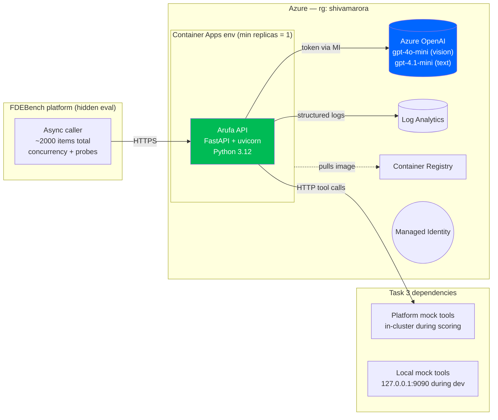
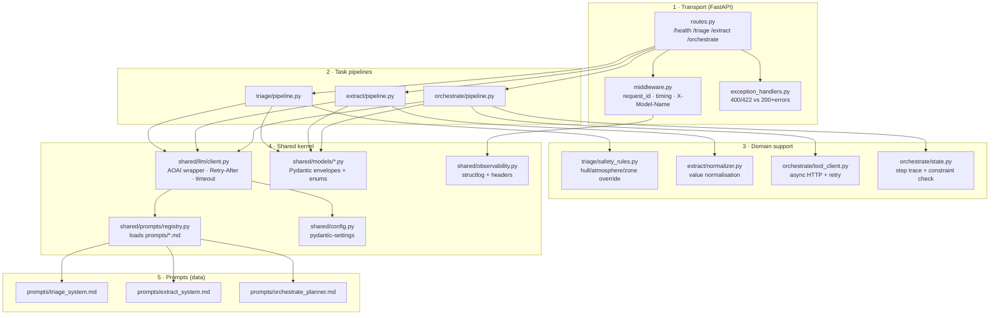
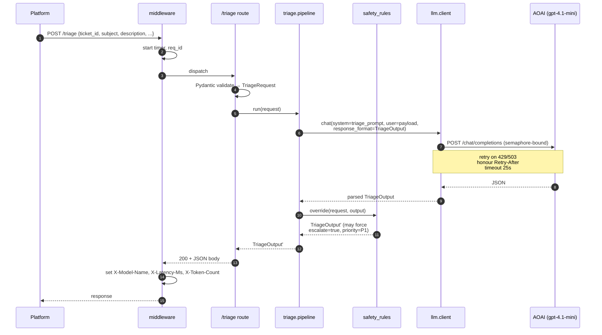
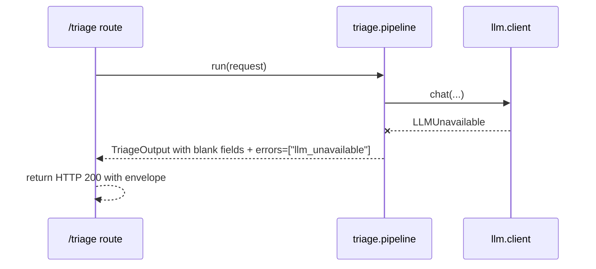
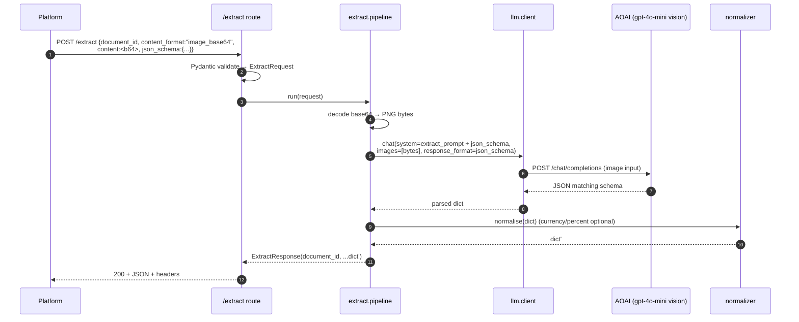
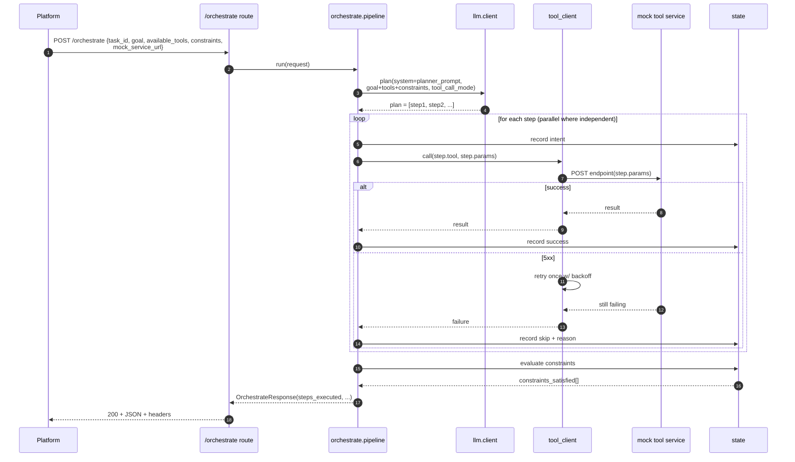
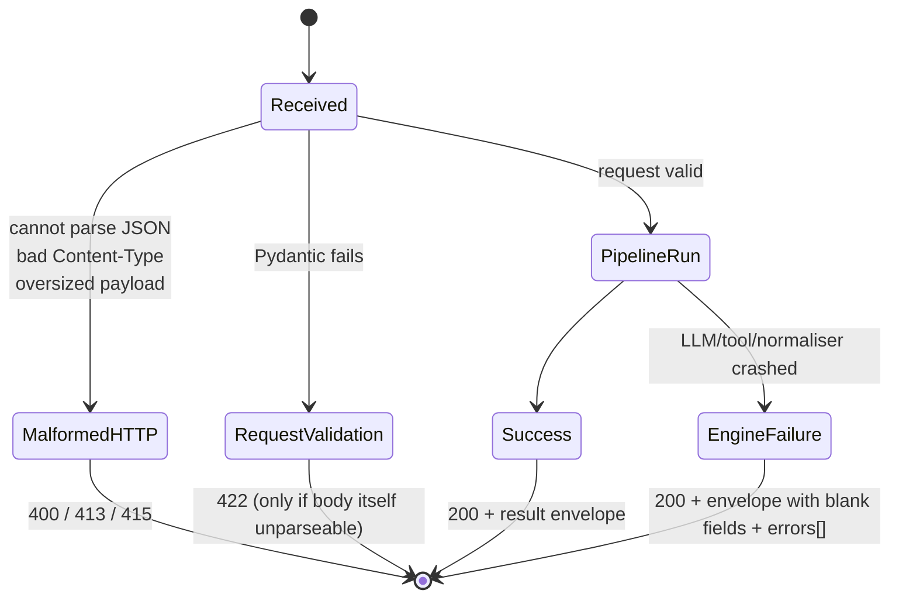
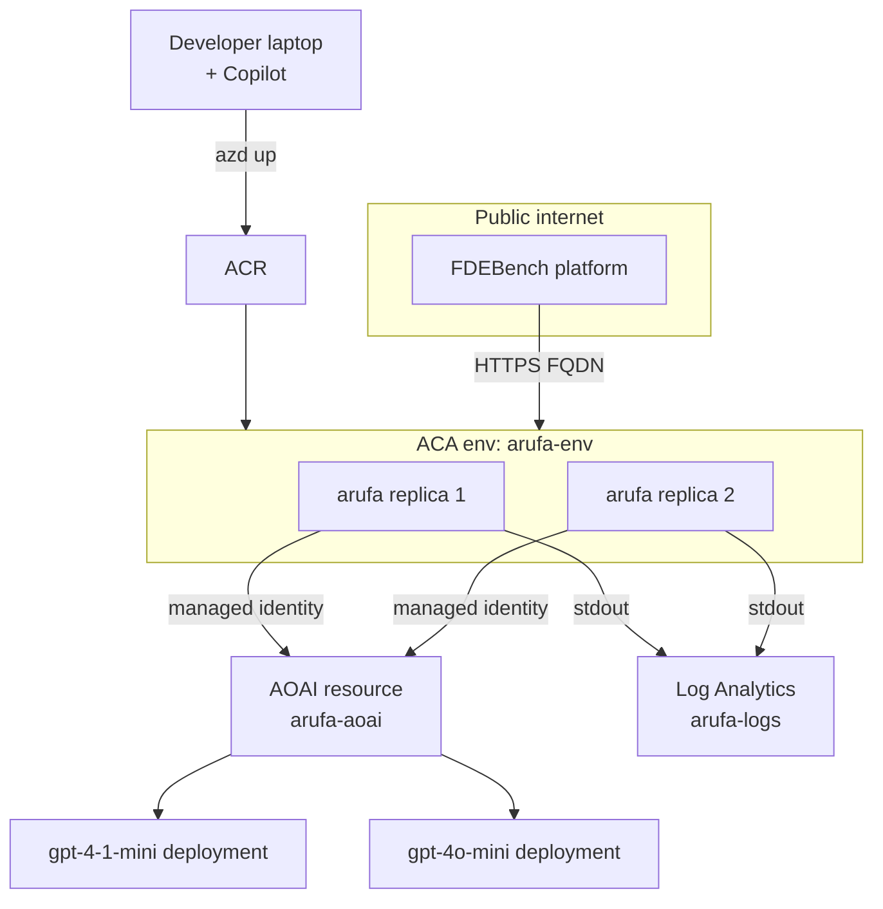
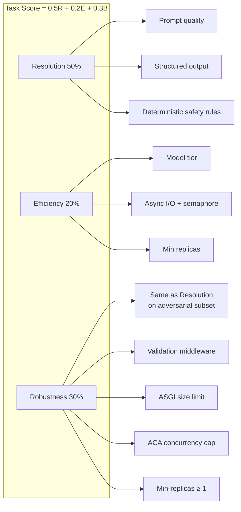

# System Architecture — Arufa (FDE for a Day)

> Grounded in [01-problem-understanding.md](01-problem-understanding.md) and the
> `docs/challenge/*` + `docs/eval/fdebench.md` briefs. Reflects the confirmed
> decisions on C1–C6, A1–A12, and O1–O4.

---

## 1. Architecture principles

Every principle traces to a requirement. If a design choice below doesn't
serve one of these, cut it.

| # | Principle | Why (grounded) |
|---|---|---|
| P1 | **Contract-first, schema-locked.** Fixed enums, Pydantic on every boundary. | Architect V2: "if your endpoint returns free-form prose, we can't route on it". Scorer: category / team / missing-info are exact-string F1. |
| P2 | **Fail loud but with `HTTP 200 + errors[]` on valid inputs.** 4xx only for malformed HTTP/JSON. | C1 resolution + scorer's 200-vs-4xx rule. Any 5xx on a valid item = 0 credit. |
| P3 | **Observability on the failure path too.** `X-Model-Name`, latency, token headers on **every** response. | Architect V2 + scorer's cost-tier requires header on every scored call. |
| P4 | **Model tier is a first-class trade-off knob.** Default to mini-tier; escalate only where accuracy demands. | Efficiency scoring: cost is 8% of total; premium models cost points. |
| P5 | **Own the dependency reliability.** Retry-with-`Retry-After` around AOAI, per-call timeout < platform 60 s, semaphore bounded by TPM quota. | `docs/eval/fdebench.md`: platform retries are a courtesy, not a safety net. |
| P6 | **Deterministic safety net around LLM judgment.** Hull-breach / atmosphere / restricted-zone → force escalate. | Kapoor V1: "always escalate, no exceptions" — cheap post-LLM rule. |
| P7 | **Prompt is data, not code.** System prompts live in files under `prompts/`, versioned. | Architect V2 non-ask + Tier 2 Code Quality. |
| P8 | **Min replicas ≥ 1.** No scale-to-zero on the scored container. | Probe #7 (cold start after 5 s idle) + P95 latency budget. |
| P9 | **Single-vendor LLM (AOAI).** Single retry loop, single header format, single quota story. | Decision O3. |
| P10 | **Consistency > peak.** Balanced across all three tasks. | V3: "80/80/80 beats 95/50/50". |

---

## 2. System context



---

## 3. Component inventory

Layered on purpose — each layer has one reason to change. All modules live inside the fork of `microsoft/be-an-fde-for-a-day` (Option B), under `py/apps/arufa/`.



### 3.1 Module responsibilities

| Module | Responsibility | Won't do |
|---|---|---|
| `routes.py` | HTTP routing, request/response envelope typing | Business logic, LLM calls |
| `middleware.py` | Request ID, latency timer, add `X-Latency-Ms` / `X-Model-Name` / `X-Token-Count` | Retry, validation |
| `exception_handlers.py` | Split: malformed request → 4xx; valid request + engine failure → 200 + `errors[]` | Anything task-specific |
| `triage/pipeline.py` | Orchestrate LLM call → parse → apply safety rules → return envelope | Own the prompt text |
| `triage/safety_rules.py` | Deterministic post-LLM override (hull/atmosphere/zone → escalate + P1) | Call LLMs |
| `extract/pipeline.py` | Decode base64, inject `json_schema` into prompt, call vision model, validate output | Store data |
| `extract/normalizer.py` | Optional: currency/percent normalisation of numeric fields | LLM calls |
| `orchestrate/pipeline.py` | Plan → dispatch → collect trace → constraint compliance report | HTTP mechanics |
| `orchestrate/tool_client.py` | Async POST to `available_tools[].endpoint`, retry, per-call timeout | Business logic |
| `orchestrate/state.py` | Immutable step trace, dependency graph, constraint evaluator | Tool I/O |
| `shared/llm/client.py` | Async AOAI wrapper: `Retry-After` honouring, semaphore, timeout, structured-output mode | Task-specific prompting |
| `shared/prompts/registry.py` | Load and cache prompt files at startup | Fill in template vars per request (that stays in pipelines) |
| `shared/models/*.py` | All Pydantic types for inputs, outputs, envelopes, `errors[]` | Business logic |
| `shared/config.py` | Env → typed settings (endpoints, deployments, timeouts, semaphores) | Hard-coded values |
| `shared/observability.py` | structlog config, header helpers | Metric aggregation |

---

## 4. Data flow — per task

### 4.1 Task 1 — `/triage`



**Failure branch** (LLM 5xx after retries):



### 4.2 Task 2 — `/extract`



Key rule enforced by prompt + Pydantic: **null for unreadable, never hallucinate**.

### 4.3 Task 3 — `/orchestrate`



**Parallelism policy**: steps whose param values don't depend on prior step outputs are fanned out with `asyncio.gather`, bounded by a semaphore.

---

## 5. Interface contracts

### 5.1 External HTTP surface

| Method | Path | Request model | Response model | Statuses |
|---|---|---|---|---|
| GET | `/health` | — | `{status:"ok"}` | 200 |
| POST | `/triage` | `TriageRequest` | `TriageResponse` | 200 (incl. envelope-on-failure), 400/422 (malformed) |
| POST | `/extract` | `ExtractRequest` | `ExtractResponse` (dynamic shape from `json_schema`) | 200 (incl. envelope-on-failure), 400/422 |
| POST | `/orchestrate` | `OrchestrateRequest` | `OrchestrateResponse` | 200 (incl. envelope-on-failure), 400/422 |

**Common response headers (every scored endpoint):**

| Header | Purpose |
|---|---|
| `X-Model-Name` | Canonical model name (e.g. `gpt-4.1-mini`) — cost-tier scoring depends on it |
| `X-Latency-Ms` | Wall-clock this handler took — observability |
| `X-Token-Count` | Prompt + completion tokens — observability |
| `X-Request-Id` | Server-generated correlation ID |
| `Retry-After` | On 429 backpressure — platform honours up to 10 s |

**Common `errors[]` envelope** (added on failure, empty on success):

```jsonc
{
  "ticket_id": "T-123",           // IDs always echoed
  "category": "",                  // blank/zero — never omitted
  "priority": "P4",
  "assigned_team": "None",
  "needs_escalation": false,
  "missing_information": [],
  "next_best_action": "",
  "remediation_steps": [],
  "errors": [
    {"code": "llm_timeout", "detail": "aoai deadline 25s exceeded"}
  ]
}
```

### 5.2 Internal module interfaces

Every pipeline exposes one entry point:

```
async def run(request: <TaskRequest>) -> <TaskResponse>
```

The shared LLM client exposes one entry point:

```
async def chat(
    system: str,
    user: str | list[ContentPart],
    response_format: type[BaseModel] | JsonSchema | None = None,
    model: ModelName,
    timeout_s: float = 25.0,
) -> LLMResult
    # LLMResult carries: parsed, raw_json, model_name, prompt_tokens, completion_tokens
```

Prompt registry:

```
def load(name: str) -> str    # loaded once at startup, cached in memory
```

Config:

```
class Settings(BaseSettings):
    aoai_endpoint: HttpUrl
    aoai_deployment_text: str    # e.g. gpt-4-1-mini
    aoai_deployment_vision: str  # e.g. gpt-4o-mini
    aoai_api_version: str
    llm_timeout_s: float = 25.0
    llm_max_concurrency: int = 8
    llm_max_retries: int = 3
    log_level: str = "INFO"
```

---

## 6. Cross-cutting concerns

### 6.1 Retry / timeout / concurrency

```mermaid
flowchart LR
    Req[pipeline call] --> Sem{semaphore<br/>llm_max_concurrency}
    Sem -->|acquired| Try[attempt N]
    Try -->|200| Done[return LLMResult]
    Try -->|429/503| RA{Retry-After<br/>header?}
    RA -->|yes| Wait[sleep min(header, 10s)]
    RA -->|no| Backoff[sleep 1s * 2^N]
    Wait --> Nx{N < max_retries?}
    Backoff --> Nx
    Nx -->|yes| Try
    Nx -->|no| Fail[raise LLMUnavailable]
    Try -->|timeout 25s| Nx
```

- **Semaphore** sized to AOAI TPM/RPM quota (start 8; tune from telemetry).
- **Per-call timeout** 25 s — leaves room for 2 retries under platform's 60 s ceiling.
- **`Retry-After` honouring** — OpenAI SDK does *not* do this for AOAI; we wrap it.

### 6.2 200-vs-4xx state machine



### 6.3 Observability

- **Logs**: `structlog` JSON to stdout; fields: `req_id`, `task`, `id`, `model`, `latency_ms`, `prompt_tokens`, `completion_tokens`, `outcome`, optional `error_code`. Container Apps ships stdout to Log Analytics automatically.
- **Response headers**: `X-Model-Name`, `X-Latency-Ms`, `X-Token-Count`, `X-Request-Id`.
- **No PII / no bodies logged.**

### 6.4 Security

- **Managed Identity → AOAI** (no keys in env for AOAI).
- Any other secret via env → mounted from Container Apps secret (or Key Vault reference).
- Input size limit (100 KB) applied at ASGI layer — protects against probe 4 abuse.
- No `eval()` / `exec()` anywhere; tool endpoint URLs validated (`https://` or the platform-injected `http://` for `mock_service_url`) before dispatch.
- Non-root container user in Dockerfile.

### 6.5 Configuration

| Setting | Env var | Default | Notes |
|---|---|---|---|
| AOAI endpoint | `AOAI_ENDPOINT` | — | Required |
| AOAI text deployment | `AOAI_DEPLOYMENT_TEXT` | `gpt-4-1-mini` | Also the value used for `X-Model-Name` |
| AOAI vision deployment | `AOAI_DEPLOYMENT_VISION` | `gpt-4o-mini` | Vision-capable, mini tier |
| API version | `AOAI_API_VERSION` | `2024-10-21` | |
| LLM timeout | `LLM_TIMEOUT_S` | `25` | < platform 60 s |
| Concurrency cap | `LLM_MAX_CONCURRENCY` | `8` | Tune from AOAI TPM |
| Max retries | `LLM_MAX_RETRIES` | `3` | Includes first attempt |
| Log level | `LOG_LEVEL` | `INFO` | |

`.env.example` ships with these keys and safe placeholder values.

---

## 7. Deployment architecture — Azure

Resource group: **`shivamarora`** (sub `92791f07-83ac-4f07-b2e6-51096ee0994d`).



**ACA specifics that map to scoring:**

| ACA setting | Value | Which score dimension it protects |
|---|---|---|
| `minReplicas` | 1 | Probe #7 (cold start) + latency P95 |
| `maxReplicas` | 5 | Probe #6 (concurrent burst) + hidden eval throughput |
| CPU / memory | 1 vCPU / 2 GiB | Comfortable headroom for async I/O + JSON parsing |
| Concurrency (per-replica) | 30 | Matches architect's "20–30 signal burst" ask |
| Ingress | External, HTTPS-only | Submission requirement |
| Health probe | `GET /health` | Liveness for the platform's smoke test |
| Managed identity | System-assigned, `Cognitive Services OpenAI User` on AOAI | No keys in env |

**Deployment pipeline**: `azd up` builds via ACR remote build and rolls a new revision. Traffic split defaults to 100% newest — one-command rollback via `az containerapp revision set-mode`.

---

## 8. Requirement traceability — R1–R20 → components

| Req | Requirement | Component that satisfies it |
|---|---|---|
| R1 | 4 endpoints | `routes.py` |
| R2 | Fixed enums for T1 outputs | `shared/models/triage.py` (Literal / Enum types) |
| R3 | Escalation hard-override | `triage/safety_rules.py` |
| R4 | Missing-info F1 both-sided penalty | `prompts/triage_system.md` (walk-the-16-table instruction) + prompt evals |
| R5 | Dynamic output shape from `json_schema` | `extract/pipeline.py` inlines schema; `llm.client` uses provider JSON-schema mode |
| R6 | Return `null`, no hallucination | `prompts/extract_system.md` + Pydantic `Optional[T]` |
| R7 | Real HTTP tool calls on T3 | `orchestrate/tool_client.py` (httpx AsyncClient) |
| R8 | Constraint compliance = 40% of T3 | `orchestrate/state.py` (constraint evaluator + `constraints_satisfied[]` in response) |
| R9 | 200-with-envelope on valid failures | `exception_handlers.py` + per-pipeline `try/except` |
| R10 | Retry loop honouring `Retry-After` | `shared/llm/client.py` |
| R11 | Per-call timeout 25–30 s | `shared/llm/client.py` (`timeout_s` param) |
| R12 | 7 resilience probes | `exception_handlers.py` (probes 1–3, 5), ASGI size limit (probe 4), ACA concurrency (probe 6), min-replicas 1 (probe 7) |
| R13 | `X-Model-Name` header | `middleware.py` reading contextvar populated by `llm.client` |
| R14 | Sub-second hot path, 20–30 concurrency | Mini-tier model + async + ACA concurrency=30 + semaphore |
| R15 | Pydantic types, prompt files, mocked-LLM tests, no secrets in source | `shared/models/`, `prompts/`, `tests/`, `shared/config.py` |
| R16 | Join on `request_id_key` | Pipelines echo the input ID field in every response; middleware never rewrites it |
| R17 | `docs/architecture.md`, `methodology.md`, `evals.md` substantive | Populated in fork's `docs/` — this doc is the working source for `architecture.md` |
| R18 | Dockerfile + `.env.example` + HTTPS | Repo root Dockerfile; `.env.example` at `py/apps/arufa/.env.example`; ACA ingress HTTPS-only |
| R19 | Consistency across 3 tasks | Shared kernel prevents T1 from getting a great LLM client while T3 doesn't |
| R20 | Intentional model selection | Config-driven; `X-Model-Name` broadcasts choice; methodology doc records rationale |

---

## 9. Evaluation criterion → component mapping

The scoring dimensions are how we'll be judged. Here's the exact component that owns each one.

### 9.1 Tier 1 — automated (public leaderboard)



**Resolution (50%)**

| Sub-metric | Weight in R | Component |
|---|---|---|
| **T1** Category F1 | 24% | `prompts/triage_system.md` + Literal enum in `TriageOutput` |
| **T1** Priority | 24% | Prompt table + safety_rules override |
| **T1** Routing F1 | 24% | Prompt + team-boundary examples in prompt |
| **T1** Missing-info F1 | 17% | Prompt walk-the-16-table pattern; Pydantic Set validator |
| **T1** Escalation F1 | 11% | `triage/safety_rules.py` (always-escalate list) |
| **T2** Information accuracy | 70% | Vision prompt + JSON-schema-mode + Pydantic; `extract/normalizer.py` for numeric normalisation |
| **T2** Text fidelity | 30% | Extractor prompt instruction "preserve source formatting"; normalisation runs *after* fidelity capture |
| **T3** Constraint compliance | 40% | `orchestrate/state.py` constraint evaluator |
| **T3** Goal completion | 20% | Planner prompt + state end-state check |
| **T3** Ordering | 20% | Dependency graph in `state.py` |
| **T3** Tool selection | 15% | Planner prompt (tool descriptions + few-shot) |
| **T3** Parameter accuracy | 5% | Tool-call mode + Pydantic validation on `tool.parameters` |

**Efficiency (20%)** — `0.60 × latency + 0.40 × cost`

| Sub-metric | Component / lever |
|---|---|
| Latency P95 | Mini-tier model choice; async pipelines; ACA min-replicas=1 (no cold start on scored runs); parallel tool calls in T3 |
| Cost tier (from `X-Model-Name`) | Config: `AOAI_DEPLOYMENT_TEXT=gpt-4-1-mini` (tier 0.9), `AOAI_DEPLOYMENT_VISION=gpt-4o-mini` (tier 0.9). Middleware guarantees header presence. |

**Robustness (30%)** — `0.60 × adversarial + 0.40 × probes`

| Sub-metric | Component |
|---|---|
| Adversarial accuracy | Same Resolution stack, plus deterministic safety net (P6) catches quiet-emergency and hull-breach cases the LLM might miss |
| Probe 1 (malformed JSON → 400) | `exception_handlers.py` |
| Probe 2 (empty body → 400/422) | Pydantic required-field validation |
| Probe 3 (missing field → 400/422 or defaults) | Pydantic + optional defaults |
| Probe 4 (50 KB payload → 413 or valid) | ASGI `max_body_size = 100 KB` |
| Probe 5 (wrong content-type → 415) | FastAPI `Content-Type` check in middleware |
| Probe 6 (20 in 500 ms → ≥18 valid) | ACA per-replica concurrency 30 + `maxReplicas 5` + semaphore |
| Probe 7 (cold start → valid) | `minReplicas 1` |

### 9.2 Tier 2 — judge review

| Dimension | Weight | What component / artefact carries the score |
|---|---|---|
| **Code Quality** | 25% | Layered module tree (`routes → pipelines → llm.client → prompts`), Pydantic on every boundary, per-pipeline unit tests with mocked LLM client, docstrings on public interfaces |
| **Architecture Design** | 25% | This document + `docs/architecture.md`; shared kernel + task pipelines; explicit trade-off table in `docs/methodology.md`; ACA + AOAI + MI deployment story |
| **AI Problem Solving** | 25% | Prompts as files, versioned; iteration notes in `docs/methodology.md`; `docs/evals.md` with actual `run_eval.py` numbers; explicit model-tier rationale (nano vs mini vs standard for each task) |
| **Engineering Maturity** | 25% | Dockerfile (non-root, multi-stage), `.env.example`, ACA HTTPS ingress, structured logs to Log Analytics, MI for AOAI, no keys in source, health probe wired |

---

## 10. What's explicitly out of scope

- **Postgres / persistent state** — the API is stateless per request. Architect's Postgres is *their* side.
- **AuthN/AuthZ** — the platform calls anonymously over HTTPS; adding auth would break scoring.
- **Multi-region / DR** — one region is enough for the hackathon; MI + AOAI must be co-located.
- **User-facing UI** — API only. Kapoor said so ("an API, not a chatbot").
- **Fine-tuning** — prompt engineering + safety rules only. No custom training.
- **Local Postgres or Redis** — no cache needed for stateless pipelines; if we ever add one, in-memory `functools.cache` in-process is enough for the eval window.

---

## 11. First-week build order

Sequenced so we always have a scorable end-to-end system, even at partial completion.

1. **Scaffold** — fork `microsoft/be-an-fde-for-a-day` into `Arufa` (Option B), copy reference `main.py` handler, add `/health`.
2. **Deploy skeleton to ACA** — Dockerfile, `azd init`, `azd up`. Confirm HTTPS + `/health` from public internet.
3. **Provision AOAI** — resource, `gpt-4-1-mini` + `gpt-4o-mini` deployments, grant MI `Cognitive Services OpenAI User`.
4. **Shared kernel** — `llm/client.py`, `middleware.py`, `exception_handlers.py`, `config.py`, `observability.py`. Unit tests with mocked httpx.
5. **T1 pipeline** — prompt + Pydantic model + safety rules. Score on `py/data/task1/sample.json`.
6. **T2 pipeline** — vision prompt + JSON-schema mode. Score on `py/data/task2/public_eval_50.json`.
7. **T3 pipeline** — planner + tool client + state. Score locally with mock service on 9090.
8. **Harden probes** — run all 7 probes locally, fix any that fail.
9. **Populate submission docs** — `docs/architecture.md` (from this doc), `docs/methodology.md`, `docs/evals.md` (from `run_eval.py` output).
10. **Submit.**
